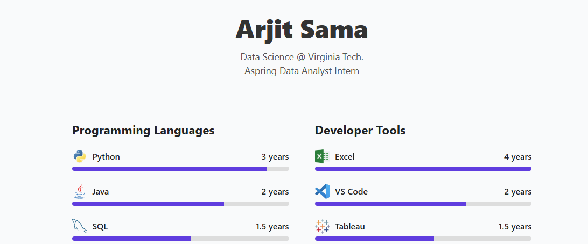

# 🌐 Arjit Sama — Portfolio Website


A personal portfolio showcasing my skills, projects, and contact information.


---

## 📌 Features
- **Responsive Design** — Works seamlessly on desktop, tablet, and mobile devices.
- **Skills Section** — Displays programming languages and developer tools with experience levels.
- **Projects Showcase** — Highlights key projects with images, descriptions, and links to GitHub repositories.
- **Contact Section** — Quick access to email, GitHub, and LinkedIn profiles.

---

## 🌐 Live Demo
Once deployed, you can view the site here:  
[https://yourusername.github.io/portfolio/](https://yourusername.github.io/portfolio/)

---

## 📸 Screenshot
  
*(Replace with an actual screenshot of your site)*

---

## 🛠️ Built With

- HTML5
- CSS3

---

## 🚀 Getting Started

### 1️⃣ Clone the Repository
```bash
git clone https://github.com/arjitsama/arjitsama.github.io.git
cd arjitsama.github.io
```

### 2️⃣ Open in Browser
```bash
Simply double-click index.html to open the portfolio in your default web browser.
```
